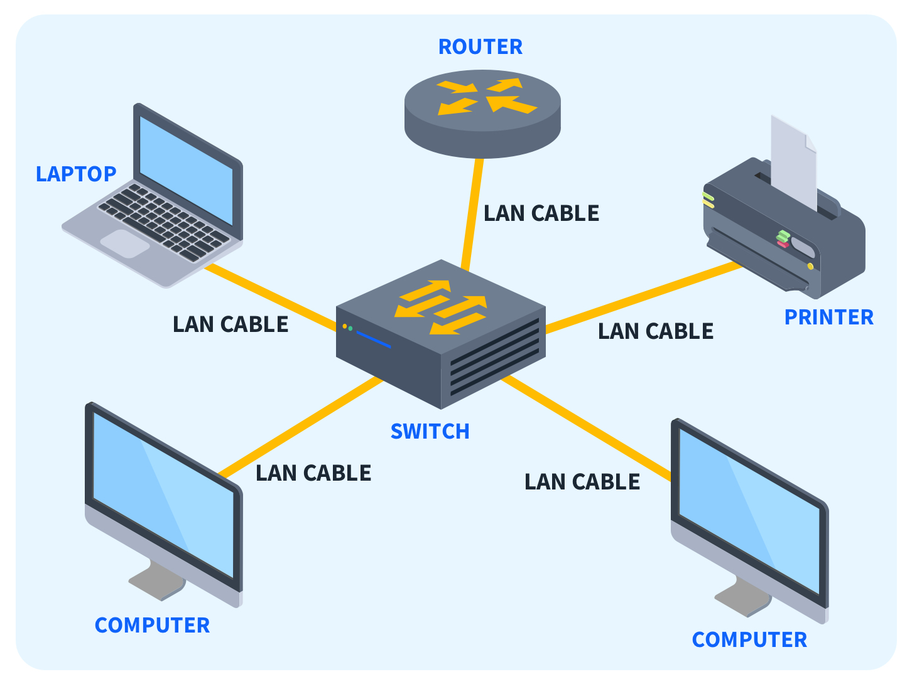
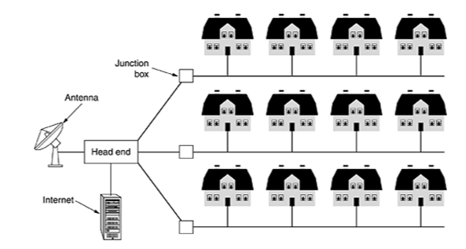
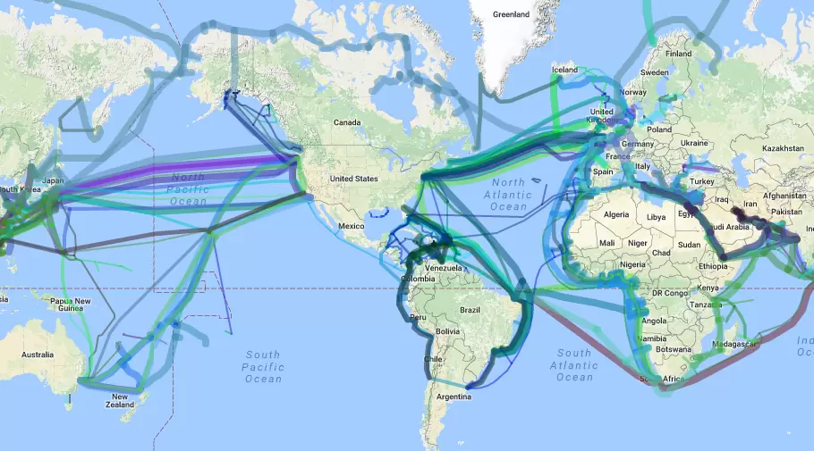
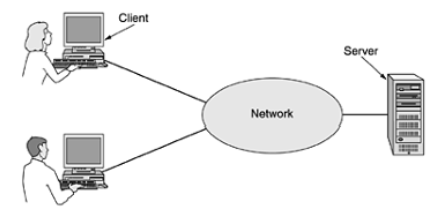

 ## 🌐 Network Basics

Seção 1: Introdução de redes
 

### O que são redes de computadores?

- Trata de um conjunto de **dispositivos conectados entre si** com o o**bjetivo de compartilhar dados, recursos e informações**.

### Quando foi criado as redes de computadores?

- As redes de computadores foram criadas no final da década de 1950 para uso militar e de defesa. Elas foram inicialmente usadas para transmitir dados por linhas telefônicas e tinham aplicações comerciais e científicas limitadas.

### É possivel se conectar a outro computador sem usar a internet?

- Sim, é possível conectar-se a outro computador sem usar a internet. Existem várias maneiras de fazer isso, sendo eles:
    - **Rede Local (LAN)**
    - **Conexão Direta com Cabo Ethernet (Crossover)**
    - **Conexão Sem Fio (Wi-Fi Direct ou Ad-Hoc)**
    - **Bluetooth**

### Se podemos nos conectar com outros computadores sem usar a internet, o que é a internet e porque utilizamos ela?

- A Internet não é de modo algum uma rede, mas sim um vasto conjunto de redes diferentes que utilizam certos protocolos comuns e fornecem determinados serviços comuns. É um sistema pouco usual no sentido de não ter sido planejado nem ser controlado por ninguém.

    A internet proporciona uma plataforma unificada e de amplo alcance para comunicação, acesso a informações, serviços, entretenimento e muito mais, transformando a forma como vivemos e trabalhamos. A infraestrutura global e os serviços oferecidos pela internet a tornam uma ferramenta indispensável na era moderna.

### Sabendo disso, quais diferentes tipos de rede de internet nós possuimos?

- **LAN (Local Area Network)**: Uma rede local, geralmente dentro de um único prédio ou campus, que conecta dispositivos próximos. A imagem abaixo representa uma rede LAN, em que vários dispositivos são conectados a um Switch e esse Switch é conectado a um Roteador. Na casa de vocês funciona da mesma maneira, porém, o modem possui o roteador e o switch já embutidos, normalmente essa separação é feita em sistemas mais complexos como empresas.

  

- **MAN (Metropolitan Area Network)**: Uma rede que cobre uma área geográfica menor que uma WAN mas maior que uma LAN, como uma cidade.

  

- **WAN (Wide Area Network)**: Uma rede ampla que cobre grandes distâncias, como entre cidades ou países, conectando várias LANs.

  

Detalhando um pouco mais é interessante saber que todo o planeta está conectado através de cabos que passam pelos oceanos ou pela terra, possibilitando assim mantermos conexões entre computadores. 

Existe um termo técnico chamado de **Backbone** é a espinha dorsal da internet — a coluna ou troncal de vários pontos de conexão. Como no corpo humano, um backbone conecta e sustenta os seus membros, aqui entendidos como servidores distantes.

Ou seja, você tem a internet da sua casa que está conectada a um backbone metropolitano que está conectada a um backbone global. Essas conexões com estes backbones possibilitam a criação de LANs, MANs e WANs.

A grosso modo rede de computadores se assemelha e muito ao nosso tráfego de veículos, em que sempre **saímos de uma origem para um destino** utilizando um caminho que nos conecte:

- Rede LAN - ruas
- Rede MAN - avenidas
- Rede WAN - estradas

Em resumo, redes de computadores e a internet, são formas de conexão que possibilitam a comunicação entre uma **origem e um destino.** Normalmente uma conexão entre um computador e um servidor.

  

### Quais são os componentes de uma rede?

- **Dispositivos**: Computadores, servidores, impressoras, etc.
- **Meios de Transmissão**: Cabos de cobre, fibra óptica, ou conexões sem fio (Wi-Fi).
- **Equipamentos de Rede**: Roteadores, switches, hubs, access points.
- **Protocolos**: Conjuntos de regras que governam a comunicação na rede (por exemplo, TCP/IP, UDP, HTTP, IMCP, etc).

Os equipamentos de rede e os protocolos, principalmente os protocolos de rede, são a base para todo o resto, entender como funcionam é um divisor de águas. A respeito deste tema, seguiremos com explicações mais detalhadas no próximo capítulo.

