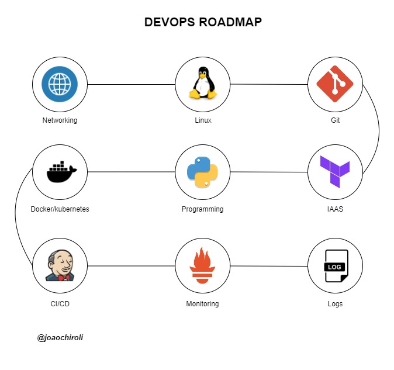

# DevOps-Projects

# Projetos DevOps do mundo real para aspirantes a engenheiros de DevOps [do iniciante ao avançado]

## Conteúdo do repositório é para projetos DevOps do nível iniciante ao avançado

### O repositório contém projetos práticos e conteúdos teóricos de DevOps adequados para indivíduos em vários níveis de habilidade, do iniciante ao avançado.

Os projetos incluídos abrangem uma ampla gama de tópicos no domínio DevOps, proporcionando experiência prática e insights sobre cenários do mundo real.

### Integração da tecnologia DevOps com outras tecnologias

Os projetos neste repositório mostram a integração de práticas DevOps com outras tecnologias de ponta, como Machine Learning, Git, GitHub, etc.

### Escopo do Projeto

Os projetos incluídos abrangem uma ampla gama de tópicos no domínio DevOps, proporcionando experiência prática e insights sobre cenários do mundo real.

### Por que explorar este repositório?

Quer você seja novo no DevOps ou esteja procurando aprimorar suas habilidades, este repositório oferece recursos e projetos valiosos para ajudá-lo a aprender e crescer na área.
